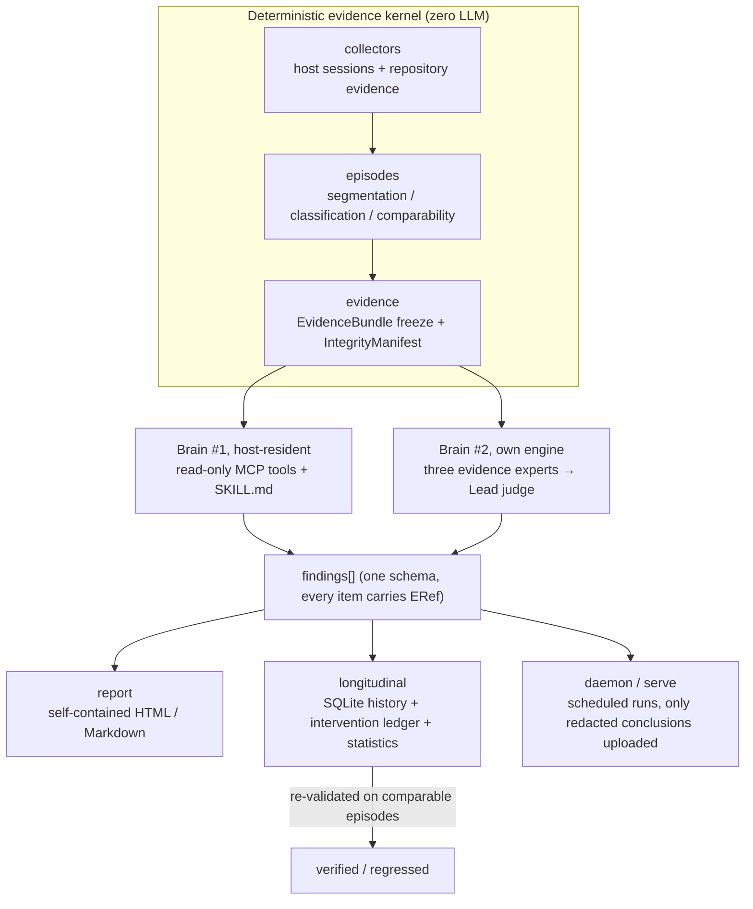

<p align="center">
  
</p>

# AfterMatter

> **Harness engineering, with evidence.** ｜ [中文](README.md) ｜ English

<p align="center">
  
</p>

<p align="center">
  <a href="https://github.com/Ember452/aftermatter/actions/workflows/ci.yml"></a>
  <a href="https://github.com/Ember452/aftermatter/actions/workflows/docs.yml"></a>
  <a href="https://github.com/Ember452/aftermatter/releases/tag/v0.1.0-m0-skeleton"></a>
  
  <a href="LICENSE"></a>
</p>

AfterMatter reads the local session logs your AI coding agent left behind (Claude Code / Codex /
Cursor / Qoder) together with the repository itself, and produces findings about the Agent Work
Loop where **every assertion points back to original bytes**. It does not stop at a report: it
drafts **bounded repairs**, then verifies with longitudinal statistics whether the improvement
actually happened.

> **Status: pre-alpha. The M0 skeleton is done (tag [`v0.1.0-m0-skeleton`](https://github.com/Ember452/aftermatter/releases/tag/v0.1.0-m0-skeleton)).**
> **There is no runnable command yet.** M2 ships the first complete report without any LLM;
> M6 is when `pip install aftermatter` becomes true.
> The build happens in the open: starring and watching is the most useful support at this stage.

---

## Why this exists: what reviewing the diff alone cannot see

AI coding agents change code fast. The weak link is the *workflow around them*, and a diff hides
exactly that:

| Failure mode | What it looks like |
|---|---|
| 🎯 Unclear goal | The agent confidently solved the wrong problem |
| 🧭 Ad-hoc execution path | Work happened along a path nobody can reproduce |
| ✅ "It works" without evidence | "The agent said the tests passed" - unverifiable |
| 🚀 Speed overriding gates | Review and delivery checks got skipped |
| 🧠 Lessons not retained | The same friction reappears on the next task |

Generic agent observability (tracing, token dashboards) is a red ocean. **Evidence-driven review
of everyday workflows plus statistical longitudinal validation is still open ground.** That is all
AfterMatter does.

## What it deliberately is not

- ❌ Not an LLM tracing / observability dashboard (no per-call token ledgers)
- ❌ Not a coding agent framework (it reviews work, it does not do the work)
- ❌ Not a model-capability leaderboard (too many confounders, wrong category)
- ❌ No GUI or evidence-browser UI in phase one (the mechanism is prepared, the UI is not)

## Differentiation (each claim survives a code-level follow-up question)

1. **Two brains, one contract**: the same deterministic evidence kernel is consumed by brain #1
   (host-resident via MCP + SKILL.md, zero API cost, interactive) and brain #2 (its own multi-provider
   engine for unattended cron/CI runs). Both emit the **same Finding schema** - the reasoning frontend
   is pluggable, the contract is not.
2. **The loop closes at "repair + longitudinal validation"**: bounded repair draft → whitelisted apply
   → intervention ledger → statistical test on comparable later episodes (bootstrap confidence
   intervals / CUSUM changepoint). It turns "I think this got better" into "the evidence shows it got better".
3. **Execution-grade evidence, not hearsay**: commands claimed to have passed are re-run in a
   sandbox with no network (`claimed_ok → replay_ok`), and blast radius (static impact) × actual test
   coverage is used to find **validation holes**.
4. **Local-first privacy**: raw sessions never leave the machine; anything outbound passes at least
   the `standard` redaction level (path normalisation, secret/PII stripping, prompts reduced to
   semantic facets).

> **Honest calibration**: the evaluation model (five dimensions, fifteen checks, evidence states,
> score ceilings) is adapted from [QoderAI/better-harness](https://github.com/QoderAI/better-harness)
> (MIT). That project **does** have finding-bound repair and later-validation concepts, and it **does**
> have an active controlled-experiment system. We do not claim otherwise. What AfterMatter adds is the
> part that does not exist there: **statistical longitudinal attribution of passive user workflows,
> executed unattended.** Full wording and source-level competitor evidence live in
> [docs/specs/2026-09-21-dual-brain-and-deepening.md](docs/specs/2026-09-21-dual-brain-and-deepening.md).
> Corrections to any overclaim are welcome and treated as bugs.

## Three rules that are code constraints, not slogans

| Rule | Where it is enforced |
|---|---|
| Present honestly: no assertion without evidence, gaps shown as `Unobserved` | The report quality validator refuses to render unsupported claims; comparison blocks must carry a machine-readable boundary statement |
| Models propose, tools decide: LLM output is only a candidate | Severity, scores and state transitions are decided by deterministic code; a score above the evidence ceiling is rejected before writing |
| Both brains share one contract | Findings from either path pass the same schema validation, pinned by integration tests |

**Score ceilings** - a dimension cannot talk its way past its evidence (inherited from the original,
tightened here):

| Evidence state | Missing / Unobserved / N-A | Present | Wired | Exercised | Outcome-supported |
|---|:---:|:---:|:---:|:---:|:---:|
| Dimension cap | ≤ 59 | ≤ 74 | ≤ 84 | ≤ 94 | ≤ 100 |

## Architecture



One `normal` analysis (target shape, from M3):

```text
collectors → episodes → evidence (freeze the Bundle into a run directory)
→ analysis (three experts concurrently, each sees only its own lane)
→ lead (verify ERefs → merge → keep dissent → grade → truncate scores at the ceiling)
→ report (schema-valid or nothing is written)
→ longitudinal (persist, flag comparable candidates)
Failure path: any expert partial/unavailable → normal refuses to publish; quick publishes with the gap shown.
```

## What works today / what does not

| | Status |
|---|---|
| `git clone` + `uv sync` + the four quality gates (ruff / ruff format / pyright / pytest) | ✅ Working; CI green on Windows/macOS/Linux × Python 3.12/3.13 |
| Dependency-direction guard (architecture rules as code) | ✅ 14 tests, including injected-violation self-checks |
| Documentation consistency gate (doc-lint) | ✅ Enforced in CI |
| `aftermatter analyze` / collectors / reports / repair / sandbox / server | ⛔ Not implemented yet (M1–M6) |

## Roadmap and progress (verifiable, not a promise board)

| Milestone | Scope | Exit criterion | Status |
|---|---|---|:---:|
| M0 skeleton | Repository layout, pyproject, CI, dependency-direction rules | ruff + pyright + pytest green pipeline | ✅ [`v0.1.0-m0-skeleton`](https://github.com/Ember452/aftermatter/releases/tag/v0.1.0-m0-skeleton) |
| M1 evidence kernel | Collectors + episode reconstruction + Bundle freeze + ERef | Real session fixtures yield a valid Bundle, 100% references resolvable | 🔜 next up |
| M2 analysis engine | Deterministic baseline scoring + state machine + report | A complete, honest report **with no LLM configured** | ⏳ |
| M3 brain #2 | LLM engine + host-parasitic entry point | Both brains emit the same schema for one Bundle | ⏳ |
| M4 closed loop | Bounded repair + ledger + history store | find → repair → ledger → re-check reproducible end to end | ⏳ |
| M5 deepening | Sandbox replay + validation holes + longitudinal stats + adversarial set | Interception / match / false-positive targets met | ⏳ |
| M6 distribution | More hosts, incremental indexing, daemon, server skeleton | First report within 5 minutes of `pip install` | ⏳ |

The single source of truth for "where are we" is
[docs/plans/ROADMAP.md](docs/plans/ROADMAP.md) section 1; per-milestone closing evidence (what was done,
what was chosen, real command output) lives in [docs/reports/](docs/reports/README.md).

## Contributions welcome right now

A single-maintainer project with explicit rules is actually a good place to land a small, precise PR:

1. **Redacted session fixtures** (highest value): M1 parser quality is capped by golden fixtures.
   Your **own** Claude Code / Codex sessions, redacted (no prompt text, no real paths, no secrets),
   become test samples. Layout: [docs/REPO-LAYOUT.md](docs/REPO-LAYOUT.md) section 3.
2. **Host format version matrices**: the field structure of a session file on a version you run saves
   us from guessing formats.
3. **Argue with the design**: [docs/architecture/](docs/architecture/INDEX.md) and the differentiation
   claims are open to challenge; an evidence-backed rebuttal becomes an ADR with credit.
4. **Small engineering tasks**: every `T-x.x` row in `docs/DEVELOPMENT-PLAN.md` is a task card with an
   acceptance command; the open decisions in ROADMAP §6 and the index-enforcement idea in ADR-0014 are
   good starting points.

Process: open an issue first ([templates are ready](https://github.com/Ember452/aftermatter/issues/new/choose))
→ branch → English Conventional Commits → all four gates green → PR. Contract changes edit the
documents first, code second. See [CONTRIBUTING.md](CONTRIBUTING.md).

## Privacy and safety boundaries

- Raw sessions, full prompts and real absolute paths never enter outbound data or test fixtures;
- repairs may only touch whitelisted paths within a diff-size limit, dry-run first, `apply` requires
  explicit confirmation, and a content-hash snapshot is taken before any write (revertable);
- replay sandbox defaults to no network, CPU/memory limits, hard timeout, read-only repository mount;
- the report pipeline refuses content it cannot support: a comparison block without a boundary
  statement is not rendered at all.

## Known risks (kept on the table)

| Risk | Mitigation |
|---|---|
| Host session files are **private formats** and will drift (the reverse-engineering tax) | Version detection first; unparseable lines fail loudly with `unparsed_count`, **never** a guessed mapping; adapters isolated per subpackage |
| Small samples lack statistical power | "Insufficient evidence" is a valid output, not a failure; the report states how many samples are missing; start with within-repository comparison |
| LLM hallucination contaminates findings | Reference gate (mandatory ERef verification) + baseline gate (deterministic cross-check) + adversarial gate (injection suite in CI) |

## Documentation map

| To understand | Start here |
|---|---|
| Scope, requirements, metrics | [docs/PRD.md](docs/PRD.md) |
| Architecture and data contract | [docs/architecture/overview.md](docs/architecture/overview.md), [data-model.md](docs/architecture/data-model.md) |
| Build order and acceptance | [docs/DEVELOPMENT-PLAN.md](docs/DEVELOPMENT-PLAN.md) |
| Why key decisions were made | [docs/adr/](docs/adr/README.md) (indexed there), [docs/specs/](docs/specs/README.md) |
| Where the project stands | [docs/plans/ROADMAP.md](docs/plans/ROADMAP.md) |
| Full reading map | [docs/README.md](docs/README.md) |

> Note: most documents under `docs/` are maintainer-facing and written in Chinese; this README and
> `README.md` are the bilingual front door, while the other community files (CONTRIBUTING /
> SECURITY / CHANGELOG) stay English. See ADR-0011 and ADR-0015 for the layering rule.

## License and credit

MIT © [Solis](LICENSE). The evaluation model is adapted from
[QoderAI/better-harness](https://github.com/QoderAI/better-harness) (MIT) - credit for making
evidence-driven workflow review a visible path. The two-brain architecture, the statistical
longitudinal validation loop and the execution-grade evidence engine are this project's own design.

If this made you think of a place in your own agent workflow where "did it actually get verified?"
has no answer - star it, and watch it get built in the open.
