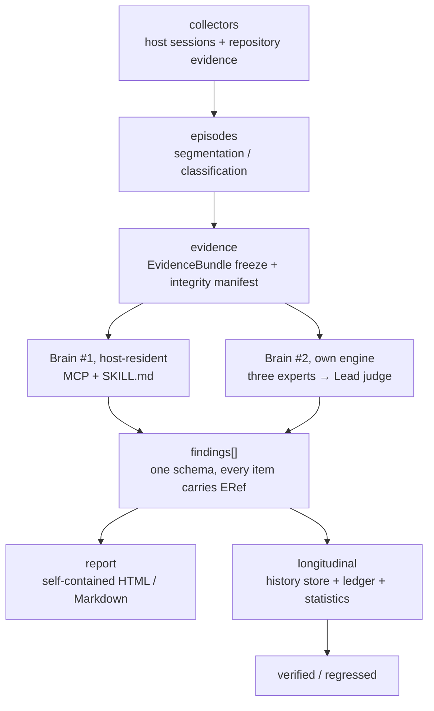

<p align="center">
  
</p>

<p align="center">
  <a href="README.md">中文</a> · English<br>
  <strong>Harness engineering, with evidence.</strong>
</p>

<p align="center">
  <a href="https://github.com/Ember452/aftermatter/actions/workflows/ci.yml"></a>
  <a href="https://github.com/Ember452/aftermatter/releases/tag/v0.1.0-m0-skeleton"></a>
  <a href="LICENSE"></a>
</p>

AfterMatter reads the local session logs your AI coding agent left behind (Claude Code / Codex /
Cursor / Qoder) together with the repository itself, and produces findings about the five-dimension
Agent Work Loop where **every assertion points back to original bytes**. It does not stop at a
report: it drafts bounded repairs, then verifies with longitudinal statistics whether the
improvement actually happened.

> **Status: pre-alpha.** The M0 skeleton is done (tag `v0.1.0-m0-skeleton`); **there is no runnable
> command yet.** M2 ships the first report that needs no LLM, M6 is when `pip install aftermatter`
> becomes true.

## Why

AI coding agents change code fast, and the weak link is usually the workflow around them - which
reviewing the final diff systematically misses: the wrong problem solved confidently, steps nobody
can reproduce, "the agent said the tests passed" with nothing to check it against, review and
delivery gates bypassed, the same friction returning on the next task.

Per-call agent observability (tracing, token dashboards) is already a red ocean. **Evidence-driven
review of everyday workflows plus statistical longitudinal validation is still open ground.** That is
all AfterMatter does - it is not a coding agent, not a tracing tool, and not a model leaderboard.

## Core mechanics

**Two brains, one contract.** A single deterministic evidence kernel (zero LLM) feeds two reasoning
frontends. Brain #1 lives in the host: read-only MCP tools plus a SKILL.md let the host agent do the
reasoning at zero API cost. Brain #2 ships its own multi-provider engine and can run unattended from
cron or CI. Both consume the same `EvidenceBundle` and emit the same `Finding` schema - the frontend
is pluggable, the contract is not.

**Repair plus longitudinal validation.** Bounded repair draft → whitelisted apply (dry-run first,
`apply` needs explicit confirmation, a content-hash snapshot before writing so it can be reverted) →
intervention ledger → bootstrap confidence intervals and CUSUM changepoint tests on **comparable**
later episodes. Only a significant result promotes to `verified`; otherwise the finding stays
`fixed` and the report states how many samples are missing. "Insufficient evidence" is a valid
output, not a failure.

**Execution-grade evidence, not hearsay.** Commands claimed to have passed are re-run in a
no-network sandbox (`claimed_ok → replay_ok`), and static impact (blast radius) × actual test
coverage is used to find **validation holes** - changing core code while only running peripheral
tests gets caught.

**Scores cannot be talked up.** Evidence state caps each dimension: Missing / Unobserved / N-A ≤ 59,
Present ≤ 74, Wired ≤ 84, Exercised ≤ 94, Outcome-supported ≤ 100. A score above its ceiling is
rejected by the validator before anything is written.

**Local-first privacy.** Raw sessions, full prompts and real absolute paths never leave the machine
and never enter test fixtures. Anything outbound passes at least the `standard` redaction level (path
normalisation, secret/PII stripping, prompts reduced to semantic facets).

## Architecture



One run: `collectors → episodes → evidence → experts → Lead (verify ERefs → merge → grade → truncate
at the ceiling) → report → longitudinal`. When an expert's evidence is missing, `normal` depth refuses
to publish; `quick` publishes with the gap shown.

## What works today

```bash
git clone https://github.com/Ember452/aftermatter.git
cd aftermatter
uv sync
uv run pytest -q        # 14 architecture guard tests (dependency direction enforced in code)
uv run ruff check .
uv run pyright
```

The `aftermatter` command, collectors, report rendering, repair, sandbox and server are not
implemented yet (M1-M6). What is in place: src-layout toolchain, a three-platform CI matrix
(3.12/3.13 × ubuntu/windows/macos), the dependency-direction guard, and the documentation gate.

## Roadmap

| Milestone | Exit criterion | Status |
|---|---|:---:|
| M0 skeleton | ruff + pyright + pytest green pipeline | ✅ `v0.1.0-m0-skeleton` |
| M1 evidence kernel | Real session fixtures yield a valid Bundle, 100% references resolvable | next up |
| M2 analysis engine | A complete, honest report with no LLM key configured | — |
| M3 brain #2 | Both brains emit the same schema for one Bundle | — |
| M4 closed loop | find → repair → ledger → re-check reproducible end to end | — |
| M5 deepening | adversarial interception, match accuracy and false-positive targets met | — |
| M6 distribution | first report within 5 minutes of `pip install` | — |

Live status: [docs/plans/ROADMAP.md](docs/plans/ROADMAP.md) section 1. Per-milestone closing records
(what was done, what was chosen, real command output) live in [docs/reports/](docs/reports/README.md).

## Contributing

Four things that are useful right now, without waiting for features:

1. **Redacted session fixtures** - the ceiling on M1 parser quality. Your own Claude Code / Codex
   sessions with prompt text, real paths and secrets removed, as test samples (layout:
   [docs/REPO-LAYOUT.md](docs/REPO-LAYOUT.md) section 3).
2. **Host format version matrices** - the field structure of a session file on a version you run
   saves us from guessing formats.
3. **Argue with the design** - [docs/architecture/](docs/architecture/INDEX.md) and the
   differentiation claims are open to evidence-backed challenge; a rebuttal that holds becomes an ADR
   with credit.
4. **Pick a task card** - every `T-x.x` row in [docs/DEVELOPMENT-PLAN.md](docs/DEVELOPMENT-PLAN.md)
   ships with its own acceptance command.

Process: open an issue first → branch → English Conventional Commits → all four quality gates green →
PR. Contract changes edit the documents first, code second. See [CONTRIBUTING.md](CONTRIBUTING.md).

## Known limits

- **Host session files are private formats and will drift.** Version detection comes first;
  unparseable lines fail loudly with `unparsed_count` and are never guessed into a mapping; adapters
  are isolated per host to bound the blast radius. We do not promise never-expiring compatibility.
- **Small samples have limited statistical power.** Within-repository comparison comes before
  cross-repository, and the report must state how many samples are missing.
- **LLMs hallucinate.** Three structural gates: the reference gate (mandatory ERef verification),
  the baseline gate (deterministic cross-check) and the adversarial gate (an injection suite in CI).

## Documentation

[PRD](docs/PRD.md) · [Architecture](docs/architecture/overview.md) · [Data contract](docs/architecture/data-model.md) ·
[Module designs](docs/architecture/INDEX.md) · [Development plan](docs/DEVELOPMENT-PLAN.md) ·
[Decision records](docs/adr/README.md) · [Roadmap](docs/plans/ROADMAP.md) · [Reading map](docs/README.md)

Most documents under `docs/` are maintainer-facing and written in Chinese; `README.md` (Chinese) and
`README.en.md` (English) are the bilingual front door, while the other community files are English
(ADR-0011 and ADR-0015 define the layering).

## License and credit

MIT. The evaluation model (five dimensions, fifteen checks, evidence states, score ceilings) is
adapted from [QoderAI/better-harness](https://github.com/QoderAI/better-harness) (MIT). That project
already has finding-bound repair and later-validation concepts, and already has an active controlled
experiment system. What this project adds is what does not exist there: **statistical longitudinal
attribution of passive user workflows executed unattended**, plus two brains on one contract and the
execution-grade evidence engine. Full competitor evidence and the exact wording live in
[docs/specs/2026-09-21-dual-brain-and-deepening.md](docs/specs/2026-09-21-dual-brain-and-deepening.md).
