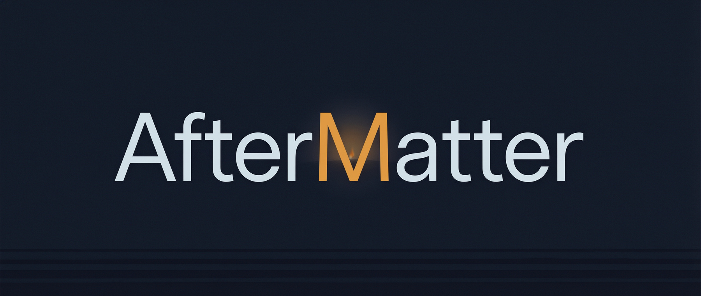
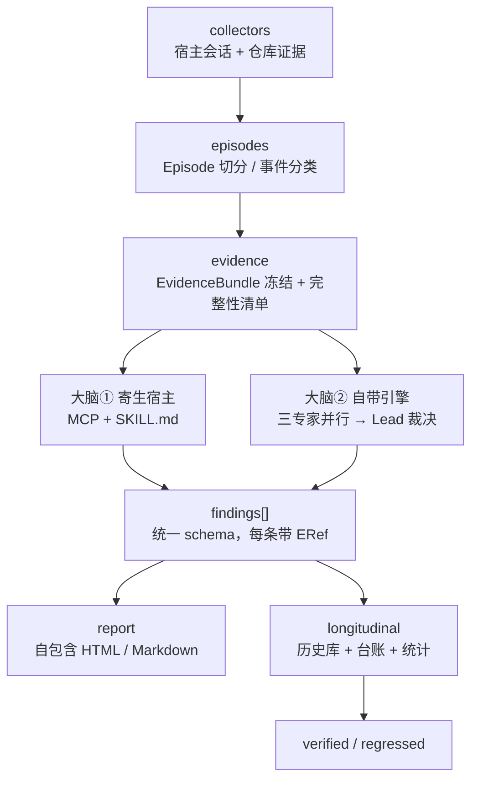

<p align="center">
  
</p>

<p align="center">
  中文 · <a href="README.en.md">English</a><br>
  <strong>Harness engineering, with evidence.</strong>
</p>

<p align="center">
  <a href="https://github.com/Ember452/aftermatter/actions/workflows/ci.yml"></a>
  <a href="https://github.com/Ember452/aftermatter/releases/tag/v0.1.0-m0-skeleton"></a>
  <a href="LICENSE"></a>
</p>

AfterMatter 读你的 AI 编码 Agent（Claude Code / Codex / Cursor / Qoder）留在本机的会话与仓库证据，
按五维 Agent Work Loop 产出改进发现，**每条断言都能指回原始字节**。它不止给报告：还会起草有界修复，
并用纵向统计验证改进是否真的发生了。

> **状态：pre-alpha。** M0 骨架已完成（tag `v0.1.0-m0-skeleton`），**目前没有可运行命令**。
> M2 出第一份不依赖 LLM 的报告，M6 起才是 `pip install aftermatter`。

## 为什么

Agent 改代码很快，薄弱环节往往在围绕它的工作流，而只看最终 diff 会系统性漏掉这些：目标被解决错了、
执行路径无人可复现、"Agent 说测试过了"无从考证、审查与交付检查被绕过、同样的摩擦在下一个任务重演。

面向单次调用的 Agent 可观测（tracing、token 大盘）已经是红海；**面向日常工作流的证据驱动体检 +
统计纵向验证**仍是空白带。AfterMatter 只做后者——它不是 coding agent（不执行开发任务），
不是 tracing 工具，也不做模型能力榜单。

## 核心机制

**双大脑，同一契约。** 同一个确定性证据内核（零 LLM）向上供两推理前端：大脑①寄生宿主，通过 MCP
只读工具 + SKILL.md 由宿主 Agent 承担推理，零 API 成本；大脑②自带多 Provider 引擎，可在 cron / CI
无人值守运行。两者消费同一份 `EvidenceBundle`、产出同一份 `Finding` schema——推理前端可插拔，契约不可分叉。

**修复 + 纵向验证闭环。** 有界修复起草 → 白名单执行（dry-run 先行、`apply` 需显式确认、写入前有内容
哈希快照可回滚）→ 干预台账 → 在后续**可比较**的 Episode 上做 bootstrap 置信区间与 CUSUM 变点检验。
显著才升 `verified`；不显著就保持 `fixed` 并写明还缺多少样本——"证据不足"是合法输出，不是失败。

**执行级证据，不信转述。** 被声称"已通过"的验证命令会在断网沙箱里复跑（`claimed_ok → replay_ok`）；
再用静态影响面（blast radius）× 实际测试覆盖面找**验证空洞**——改核心只跑边缘测试会被抓出来。

**分数不能靠话术膨胀。** 证据状态决定该维度上限：缺失 / 未观测 / 不适用 ≤ 59，Present ≤ 74，
Wired ≤ 84，Exercised ≤ 94，Outcome-supported ≤ 100。超过天花板的分数在写盘前被校验器拒绝。

**Local-first 隐私。** 原始会话、prompt 全文、真实路径永不出机器，也永不进测试 fixture；
上传内容最低过 `standard` 级脱敏（路径归一、secret/PII 剥离、prompt 摘要化为语义 facet）。

## 架构



一次分析：`collectors → episodes → evidence → 专家 → Lead（核验 ERef → 合并 → 定级 → 按天花板截断）
→ report → longitudinal`。任一专家证据缺失时，`normal` 深度拒绝出报告，`quick` 带缺口如实出。

## 现在能跑什么

```bash
git clone https://github.com/Ember452/aftermatter.git
cd aftermatter
uv sync
uv run pytest -q        # 14 个架构守卫测试（依赖方向由代码强制）
uv run ruff check .
uv run pyright
```

`aftermatter` 命令行、采集器、报告渲染、修复、沙箱、服务端均尚未实现（M1–M6）。
已就位的是：src layout 工具链、三平台 CI 矩阵（3.12/3.13 × ubuntu/windows/macos）、
依赖方向守卫、文档一致性门禁。

## 路线图

| 里程碑 | 出口标准 | 状态 |
|---|---|:---:|
| M0 骨架 | ruff + pyright + pytest 全绿流水线 | ✅ `v0.1.0-m0-skeleton` |
| M1 证据内核 | 真实会话 fixture 产出合法 Bundle，引用 100% 可解析 | 下一步 |
| M2 分析引擎 | 无任何 LLM key 的环境产出完整诚实报告 | — |
| M3 大脑② | 双大脑对同一 Bundle 产出同 schema 报告 | — |
| M4 闭环 | 发现 → 修复 → 台账 → 复查端到端可复现 | — |
| M5 深化 | 对抗集拦截率、匹配准确率、假阳性率达标 | — |
| M6 分发 | `pip install` 后 5 分钟内出首份报告 | — |

实时进度看 [docs/plans/ROADMAP.md](docs/plans/ROADMAP.md) 的「§1 当前阶段快照」；
每个里程碑的收口记录（做了什么、选了什么、真实命令输出）在 [docs/reports/](docs/reports/README.md)。

## 贡献

现在就有价值、且不需要等功能的四件事：

1. **脱敏会话 fixture**——M1 解析器质量的天花板。用你自己的 Claude Code / Codex 会话，
   去掉 prompt 原文、真实路径与密钥后作为测试样本（目录约定见 [docs/REPO-LAYOUT.md](docs/REPO-LAYOUT.md) 的「§3 tests 布局」）。
2. **宿主格式版本矩阵**——你手上某个版本的会话文件字段结构，能帮我们避免"猜格式"。
3. **反驳设计与口径**——[docs/architecture/](docs/architecture/INDEX.md) 与差异化主张都欢迎带证据的挑战，
   成立的反驳会被写成 ADR 并致谢。
4. **挑一张任务卡**——[docs/DEVELOPMENT-PLAN.md](docs/DEVELOPMENT-PLAN.md) 里每个 `T 编号`都自带验收命令。

流程：先开 issue 对齐 → 分支 → 英文 Conventional Commits → 四条质量门禁全绿 → PR。
契约类改动先改文档、代码跟随。详见 [CONTRIBUTING.md](CONTRIBUTING.md)。

## 已知边界

- **宿主会话是私有格式，会漂移**：版本探测先行，解析失败显式报错并计 `unparsed_count`，绝不猜映射；
  适配器按宿主独立子包，限制爆炸半径。我们不承诺对私有格式的"永不过期"兼容。
- **小样本统计效力有限**：先做仓库内自比而非跨仓库；报告必须写明缺多少样本。
- **LLM 会幻觉**：结构性三道闸兜住——引用闸（ERef 强制核验）、基线闸（确定性分交叉校验）、
  对抗闸（注入假证据的测试集进 CI）。

## 文档

[PRD](docs/PRD.md) · [架构总览](docs/architecture/overview.md) · [数据契约](docs/architecture/data-model.md) ·
[模块设计](docs/architecture/INDEX.md) · [开发计划](docs/DEVELOPMENT-PLAN.md) · [决策记录](docs/adr/README.md) ·
[演进路线](docs/plans/ROADMAP.md) · [阅读地图](docs/README.md)

`docs/` 下多为面向维护者的中文设计文档；`README.md`（中文）与 `README.en.md`（英文）是双语门面，
其余社区文件为英文（分层规则见 ADR-0011 与 ADR-0015）。

## 许可与致谢

MIT。评估模型（五维十五检查、证据状态、评分天花板）借鉴并改造自
[QoderAI/better-harness](https://github.com/QoderAI/better-harness)（MIT）——它已经有
finding-bound repair 与 later-validation 的概念，也已经有主动受控实验系统；本项目做的是它没有做的部分：
**用户被动工作流的统计纵向归因 + 无人值守执行**，以及双大脑同契约与执行级证据引擎。
完整竞品证据与口径见 [docs/specs/2026-09-21-dual-brain-and-deepening.md](docs/specs/2026-09-21-dual-brain-and-deepening.md)。
