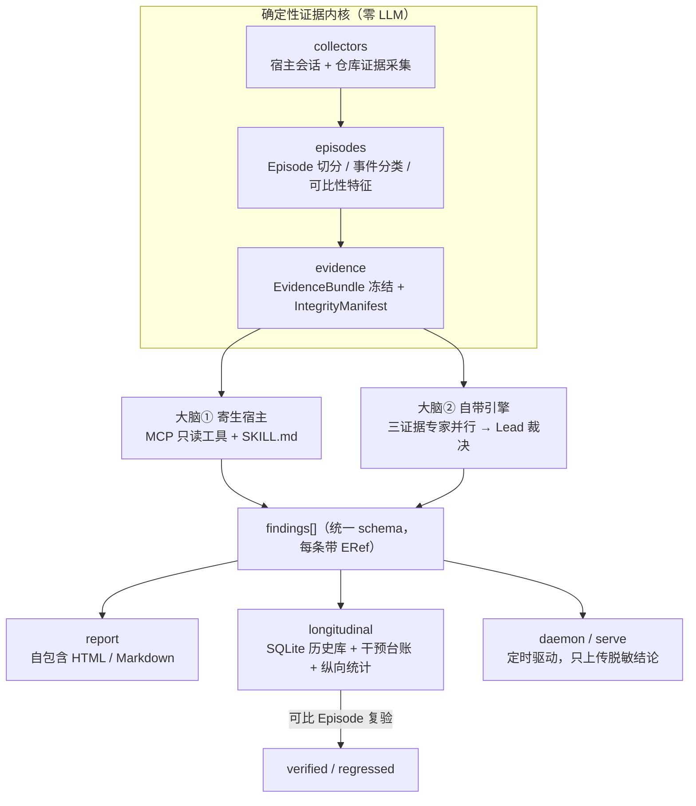

<p align="center">
  
</p>

# AfterMatter

> **Harness engineering, with evidence.** ｜ 中文 ｜ [English](README.en.md)

<p align="center">
  
</p>

<p align="center">
  <a href="https://github.com/Ember452/aftermatter/actions/workflows/ci.yml"></a>
  <a href="https://github.com/Ember452/aftermatter/actions/workflows/docs.yml"></a>
  <a href="https://github.com/Ember452/aftermatter/releases/tag/v0.1.0-m0-skeleton"></a>
  
  <a href="LICENSE"></a>
</p>

读你编码 Agent（Claude Code / Codex / Cursor / Qoder）留在本机的会话与仓库证据，按五维
Agent Work Loop 产出**每条断言都能指回原始字节**的改进发现。它不止给报告——还会起草**有界修复**，
并用纵向统计验证"改进是否真的发生了"。

> **当前状态：pre-alpha（M0 骨架已完成，tag [`v0.1.0-m0-skeleton`](https://github.com/Ember452/aftermatter/releases/tag/v0.1.0-m0-skeleton)）。**
> **现在还没有任何可运行命令。** M2 出第一份不依赖 LLM 的诚实报告，M6 才是 `pip install aftermatter`。
> 这是一个公开长出来的项目：想看一个"证据可回溯"的 Agent 工作流审查器怎么被造出来，Star / Watch 就是最实在的支持。

---

## 为什么需要它：只看 diff 会系统性漏掉的东西

AI 编码 Agent 改代码很快，但**围绕它的工作流**才是薄弱环节，而 diff 恰恰看不见这些：

| 痛点 | 表现 |
|------|------|
| 🎯 目标模糊 | Agent 信心十足地解决了错误的问题 |
| 🧭 执行路径随意 | 工作走在无人能复现的路径上 |
| ✅ "能跑"没有证据 | "Agent 说测试过了"——无从考证 |
| 🚀 速度压过门禁 | 审查与交付检查被绕过 |
| 🧠 经验不沉淀 | 同样的摩擦在下一个任务里反复出现 |

泛化 Agent 可观测（tracing / token 流水账）已经是红海；**"面向日常工作流的证据驱动体检 +
统计纵向验证"仍是空白带**。AfterMatter 只做后者。

## 它不做什么（先把边界划清，省彼此时间）

- ❌ 不是 LLM tracing / 可观测大盘（不看单次调用与 token 流水账）
- ❌ 不是编码 Agent 框架（不执行开发任务，我们是审查者不是执行者）
- ❌ 不做模型能力榜单（"GPT vs Claude"混杂太多）
- ❌ 一期不做 GUI / 证据浏览器 UI（只预埋机制）

## 差异化主张（每条都经得起代码级追问）

1. **双大脑，同一契约**：同一个确定性证据内核，大脑①寄生宿主（MCP + SKILL.md，零 API 成本、
   交互式），大脑②自带多 Provider 引擎（cron / CI 无人值守）。两者消费同一份 EvidenceBundle、
   产出同一份 Finding schema——推理前端可插拔，契约不可分叉。
2. **闭环做到"修复 + 纵向验证"**：有界修复起草 → 白名单执行 → 干预台账 → 后续可比较 Episode 的
   统计检验（bootstrap 置信区间 / CUSUM 变点）。把"我以为改进了"变成"证据证明改进了"。
3. **执行级证据，不信转述**：对被声称"已通过"的命令在断网沙箱里复跑（`claimed_ok → replay_ok`），
   再用 blast radius 静态影响面 × 实际测试覆盖面找**验证空洞**。
4. **Local-first 隐私**：原始会话永不出机器；出机数据最低过 `standard` 级脱敏（路径归一、
   secret/PII 剥离、prompt 摘要化为语义 facet）。

> **诚实校准**：本项目的评价模型（五维十五检查、证据状态、评分天花板）借鉴并改造自
> [QoderAI/better-harness](https://github.com/QoderAI/better-harness)（MIT）。它**已经有**
> finding-bound repair 与 later-validation 的概念，也**已经有**主动受控实验系统。我们不说"它没有"；
> 我们做的是它没有做的部分：**用户被动工作流的统计纵向归因 + 无人值守执行**。
> 完整口径与竞品源码级证据见 [docs/specs/2026-09-21-dual-brain-and-deepening.md](docs/specs/2026-09-21-dual-brain-and-deepening.md)。
> 欢迎原版作者与社区指出任何失准表述——这类更正我们当作 bug 收。

## 三条设计铁律（它们同时是代码约束，不是口号）

| 铁律 | 机器化落点 |
|------|-----------|
| 诚实呈现：没证据的断言不写，缺口显式标 `Unobserved` | `report` 质量校验器拒绝渲染无证据断言；比较块必须携带机器可读的边界声明 |
| 模型提议、工具裁决：LLM 只能产出 candidate | `severity`/分数/状态迁移由确定性代码判定；越证据天花板的分数在写盘前被拒 |
| 双大脑同契约 | 两条链路产出过同一 schema 校验，由 integration 测试固化 |

**评分天花板**（分数不可能靠话术膨胀，继承并强化原版）：

| 证据状态 | 缺失 / 未观测 / 不适用 | Present | Wired | Exercised | Outcome-supported |
|---|:---:|:---:|:---:|:---:|:---:|
| 该维度上限 | ≤ 59 | ≤ 74 | ≤ 84 | ≤ 94 | ≤ 100 |

## 架构



一次 `normal` 分析（目标形态，M3 起）：

```text
collectors → episodes → evidence（冻结 Bundle，落 run-dir）
→ analysis（三专家并发，各自只见自己那条 lane）
→ lead（ERef 核验 → 合并 → 保留异议 → 定级 → 按天花板截断分数）
→ report（schema 校验通过才允许写盘）
→ longitudinal（入历史库，标记可比较候选）
失败路径：任一专家 partial/unavailable → normal 拒绝出报告；quick 显式带缺口出。
```

## 现在能跑什么 / 还不能跑什么

| | 状态 |
|---|---|
| `git clone` + `uv sync` + 四条质量门禁（ruff / ruff format / pyright / pytest） | ✅ 可用，Windows/macOS/Linux × Python 3.12/3.13 CI 全绿 |
| 依赖方向守卫（架构规则机器化） | ✅ 14 个测试，含注入违规样例自证 |
| 文档一致性门禁（doc-lint） | ✅ 已进 CI |
| `aftermatter analyze` / 采集 / 报告 / 修复 / 沙箱 / 服务端 | ⛔ 尚未实现（M1–M6） |

## 路线图与进度（可核验，不是承诺表）

| 里程碑 | 内容 | 出口标准 | 状态 |
|---|---|---|:---:|
| M0 骨架 | 仓库结构、pyproject、CI、依赖方向规则 | ruff + pyright + pytest 全绿流水线 | ✅ [`v0.1.0-m0-skeleton`](https://github.com/Ember452/aftermatter/releases/tag/v0.1.0-m0-skeleton) |
| M1 证据内核 | 采集 + Episode 重建 + Bundle 冻结 + ERef | 真实会话 fixture 产出合法 Bundle，引用 100% 可解析 | 🔜 下一步 |
| M2 分析引擎 | 确定性基线评分 + 状态机 + 报告 | **无 LLM 环境**产出完整诚实报告 | ⏳ |
| M3 大脑② | LLM 引擎 + 宿主寄生入口 | 双大脑对同一 Bundle 产出同 schema 报告 | ⏳ |
| M4 闭环 | 有界修复 + 台账 + 历史库 | "发现→修复→台账→复查"端到端可复现 | ⏳ |
| M5 深化 | 沙箱复跑 + 验证空洞 + 纵向统计 + 对抗集 | 拦截率 / 匹配准确率 / 假阳性率达标 | ⏳ |
| M6 分发 | 更多宿主 + 增量索引 + daemon + 服务端骨架 | `pip install` 后 5 分钟出首份报告 | ⏳ |

进度事实源：[docs/plans/ROADMAP.md](docs/plans/ROADMAP.md) 的「§1 当前阶段快照」；
每个里程碑的收口证据（做了什么、选了什么、真实命令输出）在 [docs/reports/](docs/reports/README.md)。

## 现在就欢迎来做的事

单人项目 + 明确纪律，反而适合"提一个小而准的东西就合掉"：

1. **贡献脱敏会话 fixture**（最有价值）：M1 的解析器质量上限由黄金 fixture 决定。
   需要你**自己**的 Claude Code / Codex 会话，脱敏后（去掉 prompt 原文、真实路径、密钥）
   作为测试样本。目录约定见 [docs/REPO-LAYOUT.md](docs/REPO-LAYOUT.md) 的「§3 tests 布局」。
2. **宿主格式版本矩阵**：你手上某个版本的会话文件字段结构，帮我们避免"猜格式"。
3. **挑刺设计与口径**：[docs/architecture/](docs/architecture/INDEX.md) 与差异化主张都欢迎反驳，
   带证据的反驳会被写成 ADR 并致谢。
4. **小工程任务**：`docs/DEVELOPMENT-PLAN.md` 的每个 `T 编号`都是一张带验收标准的任务卡；
   `docs/plans/ROADMAP.md` §6 的决策点与 ADR-0014 里登记的"索引机器化"也是好起点。

流程：先开 issue 对齐（[模板已备好](https://github.com/Ember452/aftermatter/issues/new/choose)）→
分支 → 英文 Conventional Commits → 四条门禁全绿 → PR。契约类改动**先改文档再改代码**。
详见 [CONTRIBUTING.md](CONTRIBUTING.md)。

## 隐私与安全边界

- 原始会话、prompt 全文、真实路径**永不进入**出机数据与测试 fixture；
- 修复只允许写白名单路径 + diff 行数上限，dry-run 先行，`apply` 需显式确认，写入前有内容哈希快照（可回滚）；
- 重放沙箱默认断网、CPU/内存限额、超时硬杀、仓库只读挂载；
- 报告链路拒绝无证据内容：无边界声明的比较块渲染器直接不出图。

## 已知风险（公开记账，不藏）

| 风险 | 应对 |
|---|---|
| 宿主会话是**私有格式**，会漂移（逆向维护税） | 版本探测先行；解析失败显式报错并计 `unparsed_count`，**绝不猜映射**；适配器子包隔离爆炸半径 |
| 小样本下统计效力不足 | "证据不足"是合法输出而非失败；报告会写明还缺多少样本；先做仓库内自比 |
| LLM 幻觉污染发现 | 引用闸（ERef 强制核验）+ 基线闸（确定性分交叉）+ 对抗闸（注入测试集进 CI） |

## 文档地图

| 想了解 | 看这里 |
|---|---|
| 做什么、需求与指标 | [docs/PRD.md](docs/PRD.md) |
| 架构与数据契约 | [docs/architecture/overview.md](docs/architecture/overview.md)、[data-model.md](docs/architecture/data-model.md) |
| 按什么顺序做、怎么验收 | [docs/DEVELOPMENT-PLAN.md](docs/DEVELOPMENT-PLAN.md) |
| 关键决策为什么这么做 | [docs/adr/](docs/adr/README.md)（索引见其 README）、[docs/specs/](docs/specs/README.md) |
| 现在走到哪了 | [docs/plans/ROADMAP.md](docs/plans/ROADMAP.md) |
| 全量阅读地图 | [docs/README.md](docs/README.md) |

> 说明：`docs/` 下多为面向维护者的中文设计文档；本 README 与 `README.en.md` 是门面，其余社区文件
> （CONTRIBUTING / SECURITY / CHANGELOG）为英文。语言分层规则见 ADR-0011 与 ADR-0015。

## 许可与致谢

MIT © [Solis](LICENSE)。评估模型借鉴并改造自 [QoderAI/better-harness](https://github.com/QoderAI/better-harness)（MIT）——
感谢它把"证据驱动的工作流审查"这条路走通到能被看见；双大脑、统计纵向验证闭环与执行级证据引擎为本项目独立设计。

如果这个项目让你想到自己 Agent 工作流里某处"说不清有没有验证过"的地方 —— Star 一下，它会持续公开长出来。
