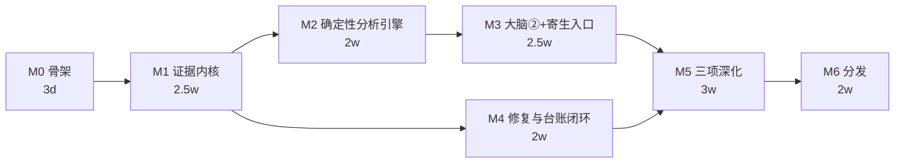

# AfterMatter 开发计划

状态: 定稿 | 版本: v1.0 | 层级: 阶段 3 | 派生自: 项目设计文档 v1.0（§6/§8）、architecture/ 契约与模块设计各篇、项目结构 v1.0

> 本计划是 M0–M6 的唯一执行蓝本。**内容全部派生自既有文档，不新增设计决定**；
> 凡 PRD/architecture 未决定的实现细节（库版本、目录内文件拆分），留给实现会话现场决定。

---

## 第 1 章 执行协议

**任务粒度**：一个任务（T 编号）= 一次 AI 会话可完成，以验收命令通过为终点。跨会话任务必须在完成前保持"进行中"状态并记录断点。

**Definition of Done（每任务统一）**：

```
uv run ruff check . && uv run ruff format --check .   # 风格
uv run pyright                                        # 公共 API 零错误
uv run pytest tests/unit/<对应路径> -q                # 本任务测试全绿，且全量 unit 不回退
```

契约类任务（涉及数据模型）额外要求：**先改 architecture/data-model.md 并递增版本号，后写代码**。

**里程碑收尾仪式**：跑第 5 章该里程碑验收清单全项 → 汇报改动清单与测试结果 → 询问 commit / 打 tag（未经用户明确要求不提交）。

**铁律（继承 PRD，违反即计划失败）**：

1. M2 完成前不写任何 LLM 调用代码（R5 对策：最长战线不依赖最不确定层）
2. `tests/adversarial/` 用例只增不减，拦截率门禁从 M5 起进 CI
3. 每个适配器/渲染器/统计模块的 fixture 与标注先于实现（测试先行）

---

## 第 2 章 依赖总图



- **关键路径**：M1 → M2 → M3 → M5 → M6（M1 证据内核是全项目咽喉，其 fixture 质量决定一切下游）
- **可并行段**：M4 的 T4.1–T4.4（白名单/台账/存储，零 LLM 依赖）可与 M3 后半程并行推进
- M5 的沙箱线（T5.1–T5.4）与统计线（T5.5–T5.7）相互独立，可按周交替

---

## 第 3 章 任务分解

### M0 骨架（约 3 天）

| ID | 内容 | 来源 | 验收 | 估时 |
|----|------|------|------|:---:|
| T0.1 | pyproject.toml：src layout、依赖最小集、ruff/pyright/pytest 配置 | overview §5、结构 §1 | `uv sync && uv run pytest -q` 通过 | 0.5d |
| T0.2 | 包骨架：只建当期有代码的子包，`__init__` 导出公共 API（禁"未用先建"） | 结构 §2、§8 | `python -c "import aftermatter"` + ruff 通过 | 0.5d |
| T0.3 | tests/architecture/ import 方向守卫（overview §3 三层规则） | overview §3 | 守卫测试绿 + 注入违规样例必红 | 1d |
| T0.4 | .github/：ci.yml（3.12/3.13 × ubuntu/windows/macos）、dependabot、issue/PR 模板 | 结构 §5 | PR 上 workflow 全绿 | 0.5d |
| T0.5 | .pre-commit-config.yaml、.gitignore、LICENSE、CHANGELOG/CONTRIBUTING/SECURITY 骨架 | 结构 §1 | `pre-commit run --all-files` 通过 | 0.5d |

### M1 证据内核（约 2.5 周）｜覆盖 FR-A1/A2/A4、B1–B4、H1/H3 部分

| ID | 内容 | 来源 | 验收 | 估时 |
|----|------|------|------|:---:|
| T1.1 | core 五件套：时间规范化、sha256 稳定指纹、路径归一、TraceId 日志、异常基类 | data-model §0、modules §1 | unit 全分支覆盖 | 1d |
| T1.2 | ERef 模型 + verify_ref 解析核心（引用→原始字节 + 哈希比对） | data-model §0 铁律 | 篡改注入 fixture 必被拒 | 1.5d |
| T1.3 | Claude 适配器：discover/parse/healthcheck + 版本探测 + unparsed_count + 自身产物剔除 | FR-A1、modules §2 | ≥20 条黄金 fixture（含畸形/截断/编码陷阱）全过 | 3d |
| T1.4 | Codex 适配器（同上契约） | FR-A2、modules §2 | 同上 | 2.5d |
| T1.5 | repo 证据扫描器：AGENTS.md 质量信号、测试布局、CI workflow、git 历史与测试-源码共变 | FR-A4、modules §2 | RepositoryEvidence 快照测试 | 2.5d |
| T1.6 | 事件分类器：edit/validation/摩擦三类，命令 NFKC 归一化 identity | FR-B2、data-model §2.2 | 分类单测全覆盖（pytest/npm test/cargo/make 正则库） | 2d |
| T1.7 | Episode 切分器：30min 缺口 + 新任务 prompt 双规则；model 版本记录；可比性特征 | FR-B1/B3 | 黄金样例逐 Episode 断言 + property-based 不变量（不重叠、时间有序） | 2.5d |
| T1.8 | EvidenceBundle 冻结 + IntegrityManifest + 三 lane 三态 + run-dir 内容寻址 | data-model §3、modules §4 | integration：冻结幂等、哈希篡改必拒、lane 类型隔离 | 2d |
| T1.9 | 脱敏管道三级 raw/standard/minimal（路径归一、secret/PII 剥离、prompt→facet） | FR-H1、overview §8 | 属性测试 + 泄漏扫描（secret 正则库必过） | 1.5d |

缓冲与砍单：T1.5 的 git 共变分析深度可降级为"存在性信号"（砍 1d）；T1.3/T1.4 不可砍（关键路径）。

### M2 确定性分析引擎（约 2 周）｜覆盖 FR-C3 部分、F1/F2/F4 门禁；**零 LLM**

| ID | 内容 | 来源 | 验收 | 估时 |
|----|------|------|------|:---:|
| T2.1 | Candidate/ExpertReport 协议模型：空引用 ValidationError、lane 声明、reason_code | modules §5.1 | 非法结构注入全拒 | 1d |
| T2.2 | 确定性信号清单：15 检查 × 可实现信号（CI 存在、测试共变、验证配对率、AGENTS.md 覆盖率…） | data-model §5 | 信号清单表进 architecture/analysis.md §deterministic（膨胀再独立成篇） | 2d |
| T2.3 | 基线评分器：Bundle → BaselineScores + BaselineSignals | modules §5.2 | 黄金 Bundle 输出稳定（幂等） | 2.5d |
| T2.4 | 证据状态判定 + 评分天花板校验器（59/74/84/94/100 截断） | overview §6.3 | 越天花板分数写入必拒 | 1.5d |
| T2.5 | Finding 状态机：7 状态 + 流转白名单 + wontfix 出口 + revision 不可变 | data-model §4.2 | 白名单外迁移代码层拒绝 + 告警测试 | 2d |
| T2.6 | report-quality 校验器：无证据断言/矛盾状态/缺比较边界声明 → 拒绝渲染 | modules §9、FR-F4 | 违规报告样例全拦截 | 1.5d |
| T2.7 | HTML/MD 渲染器 + 四件套发现卡（影响/预期产出/有界修复/验收检查） | FR-F1/F2 | 自包含零外链；`Unobserved` 如实呈现 | 2.5d |

出口演示：**无任何 LLM 环境**产出完整诚实报告（deterministic-only 即 M2 主形态）。

### M3 大脑②与寄生入口（约 2.5 周）｜覆盖 FR-C1/C2/C4/C7、H2

| ID | 内容 | 来源 | 验收 | 估时 |
|----|------|------|------|:---:|
| T3.1 | providers：OpenAI 兼容/Anthropic/Ollama 薄封装 + 错误分类 + 成本计量 + FakeLLM | overview §5、modules §5.5 | 成本回写 run 指标；单测全程用 FakeLLM | 2.5d |
| T3.2 | 会话证据专家：受限上下文组装 + 输出解析 + golden set | modules §5.3 | check 归属与 severity 一致率 ≥80% | 2.5d |
| T3.3 | 项目证据专家（同上契约，输入=project lane） | 同上 | 同上 | 2d |
| T3.4 | 资产证据专家（输入=assets lane，计数不评分原则内建） | 同上 | 同上 | 2d |
| T3.5 | Lead 裁决流水线：核验→四元组合并→异议保留→定级→分数截断→冻结 | modules §5.3、overview §1 | 黄金 Bundle 定级一致率 ≥80%（FR-C2） | 3d |
| T3.6 | 预算守卫 + 降级矩阵（quick/normal 分路、deterministic-only 兜底） | overview §6.2、FR-C4 | 超限注入测试可复现降级 | 1.5d |
| T3.7 | orchestrator：三专家 asyncio 并发 + 失败隔离 + normal 拒 partial | modules §5.3 | 单专家故障注入 → normal 退出码 2 / quick 带缺口 | 1.5d |
| T3.8 | MCP server 四工具（build_bundle/query_lane/verify_refs/submit_findings，同一引用闸）+ SKILL.md | modules §5.4、FR-C7 | 宿主内一句话体检演示；submit 过 verify_ref | 2.5d |

出口演示：**双大脑对同一 Bundle 产出同 schema 报告**（integration 测试固化）。

### M4 修复与台账闭环（约 2 周）｜覆盖 FR-D1/D2、E1/E2

| ID | 内容 | 来源 | 验收 | 估时 |
|----|------|------|------|:---:|
| T4.1 | RepairPlan 模型 + 白名单校验（路径模板 + diff 行数上限，plan 期即拒越界） | FR-D1、modules §6 | 越界 diff 注入全拒 | 2d |
| T4.2 | dry-run/apply 两阶段 + 内容哈希快照 + `aftermatter revert` | FR-D2、overview §8 | 无 --yes 无写入路径存在性测试；崩溃注入无半成品 | 2.5d |
| T4.3 | InterventionLedger 两阶段记账（先记账后落盘，失败回滚 apply） | FR-E2、data-model §4.3 | 台账完整可审计 | 2d |
| T4.4 | longitudinal store：SQLite(WAL) 六表（见 longitudinal.md §store）+ schema 版本化迁移 | FR-E1、modules §8 | 迁移测试前后版本兼容 | 2.5d |
| T4.5 | 状态机驱动接入：fixed 迁移唯一入口 + open→wontfix CLI | data-model §4.2 | 白名单流转测试 | 1d |
| T4.6 | 端到端演示脚本：发现→修复→台账→复查 | PRD §8 M4 出口 | PRD M4 出口可复现 | 1.5d |

注：T4.1–T4.4 零 LLM 依赖，可与 M3 后半程并行。

### M5 三项深化（约 3 周）｜覆盖 FR-C5/C6、D3/D4、E3/E4/E5

| ID | 内容 | 来源 | 验收 | 估时 |
|----|------|------|------|:---:|
| T5.1 | 沙箱环境：docker 探测、`--network none`、CPU/内存/超时限额、只读挂载 | FR-D3、modules §7 | 限额生效集成测试；无 docker → lane unavailable | 2d |
| T5.2 | ReplayPolicy：验证命令序列重建 + 复跑 + `replay_ok` 唯一入口回填 | FR-D3、data-model §2.2 | 声称通过但复跑失败 → finding 自动升级 | 2.5d |
| T5.3 | blast radius：tree-sitter 调用图算改动影响面 | FR-D4、overview §5 | 多语言 fixture（py/js/go） | 2.5d |
| T5.4 | 测试映射归因：影响面 × 实际测试覆盖 → 验证空洞 finding | FR-D4 | "改核心只跑边缘测试"fixture 被捕获 | 2d |
| T5.5 | Episode 匹配双通道：结构化硬过滤 + 本地向量软排序 → Comparability | FR-E3 | 黄金对判别 ≥85% | 3d |
| T5.6 | 单轴归因：axis_diff 三态计算（single 可归因 / multi 仅描述 / none 噪声测量，ADR-0009） | FR-E4、data-model §4.3 | 三态注入行为全正确，理由机器可读 | 1.5d |
| T5.7 | 统计模块：bootstrap CI + CUSUM 变点 + Verdict（含 missing_n） | FR-E5、modules §8 | 无改进仿真序列 1000 轮误判 ≤50 | 2.5d |
| T5.8 | 对抗测试集：假 ERef/刷绿 CI/伪造 verified 声称/越界 diff + CI 门禁 job | FR-C6、overview §6.1 | 拦截率 100% | 2d |
| T5.9 | 双通道评分交叉：LLM 分 × 基线分冲突 → confidence=low + needs_human | FR-C5、overview §6.1 | 冲突用例集全过 | 1.5d |

### M6 分发（约 2 周）｜覆盖 FR-A3/A5/A6、G1/G2、H4

| ID | 内容 | 来源 | 验收 | 估时 |
|----|------|------|------|:---:|
| T6.1 | Cursor 适配器 | FR-A3 | 黄金 fixture 全过 | 2.5d |
| T6.2 | Qoder 适配器 | FR-A3 | 同上 | 2d |
| T6.3 | 增量索引：内容哈希缓存 + since_offset | FR-A5 | 二次采集 < 首次 20%，报告进 docs/benchmarks/ | 2d |
| T6.4 | 流式解析内存上限 | FR-A6 | 1GB 会话 < 256MB，benchmarks 报告 | 1.5d |
| T6.5 | daemon 定时驱动 + 幂等上传（idempotency key） | FR-G1/G2、overview §4.3 | 重传不产生重复行（集成测试） | 2d |
| T6.6 | serve 最小骨架：FastAPI ingest/trends + docker compose（P2 可砍） | FR-G3 | compose 一键起端到端通 | 2.5d |
| T6.7 | 英文 README + docs/development/01 + `aftermatter doctor` + PyPI 发布演练 | PRD §8 M6 出口、结构 §1 | 全新环境 `pip install` → 首份报告 5 分钟实测 | 2d |

### FR 覆盖核对表（一期边界）

| FR | 落点 | FR | 落点 |
|----|------|----|------|
| A1/A2 | T1.3/T1.4 | D1/D2 | T4.1/T4.2 |
| A3 | T6.1/T6.2 | D3/D4 | T5.2/T5.3-4 |
| A4 | T1.5 | D5 | **P2 一期不做** → docs/plans/ |
| A5/A6 | T6.3/T6.4 | E1–E5 | T4.4/T4.3/T5.5/T5.6/T5.7 |
| B1–B4 | B1/B3→T1.7、B2→T1.6、B4→T1.2 | F1/F2/F4 | T2.7/T2.6/T2.6 |
| C1–C4 | C1→T3.2–T3.4+T3.7、C2→T3.5、C3→T2.3/T2.4、C4→T3.6 | F3 | **P2**（一期静态趋势图随 T2.7 附带） |
| C5/C6 | T5.9/T5.8 | F5 | **P2 机制预埋**（ERef 反解析在 T1.2 天然满足；时间线原型可选） |
| C7 | T3.8 | G1/G2/G3 | T6.5/T6.5/T6.6 |
| H1–H5 | T1.9/T3.1/T1.8/T0.4/T0.4+T0.5 | G4 | **二期** → docs/plans/ |

---

## 第 4 章 排期（全职口径）

| 周 | 内容 |
|:---:|------|
| W1 | M0 全部 + M1 启动（T1.1–T1.2） |
| W2–W3.5 | M1（T1.3–T1.9） |
| W3.5–W5.5 | M2（T2.1–T2.7）→ 首个可演示里程碑 |
| W5.5–W8 | M3（T3.1–T3.8）；W7 起 T4.1–T4.4 并行 |
| W8–W9.5 | M4 收尾（T4.5–T4.6） |
| W9.5–W12.5 | M5（沙箱线/统计线交替） |
| W12.5–W14 | M6 |
| W14–W16 | 20% 缓冲：回归修复、文档、发布 |

**声明**：排期是沟通工具不是考核指标。计划被打破的唯一方式应是第 3 章砍单预案（P1→P2 顺序削减），而不是悄悄拖期。

---

## 第 5 章 里程碑验收清单

每里程碑收尾时逐项勾选并留存命令输出（对应 PRD §8 出口标准）。

**M0**
- [ ] `uv run ruff check . && uv run ruff format --check .` 零违规
- [ ] `uv run pyright` 零错误
- [ ] `uv run pytest tests/architecture -q` 绿，且手工注入违规 import 样例必红
- [ ] 三平台 CI 矩阵绿

**M1**
- [ ] `uv run pytest tests/unit/collectors tests/unit/episodes tests/integration/test_bundle_freeze.py -q` 全绿
- [ ] 真实脱敏 fixture 产出合法 EvidenceBundle，`verify_ref` 对全部 ERef 通过率 100%
- [ ] 篡改 IntegrityManifest 任一哈希 → verify_ref 拒绝（对抗样例）
- [ ] 脱敏泄漏扫描：secret 正则库在 standard/minimal 输出上零命中

**M2**
- [ ] 无 LLM 环境（不设任何 key）跑通 `aftermatter analyze --depth quick --engine deterministic` 产出 report.html + report.md + findings.json
- [ ] 越天花板分数/空引用 candidate/白名单外状态迁移 三类非法注入全被校验器拒绝
- [ ] 报告含 rejected 附录与 coverage 声明，`Unobserved` 处无具体断言

**M3**
- [ ] `pytest tests/integration/test_dual_brain_parity.py` 绿：双大脑对同一 Bundle 的 findings.json 过同一 schema 校验
- [ ] 三专家 golden set severity 一致率 ≥80%（脚本输出留存 docs/tests/）
- [ ] 预算超限注入 → deterministic-only 报告且整份带标注
- [ ] 宿主内 `/aftermatter 体检`（SKILL.md）演示成功录屏/记录

**M4**
- [ ] 端到端演示：open finding → plan（越界样例被拒）→ apply --yes → Ledger 落账 → revert 可回滚
- [ ] `pytest tests/integration/test_repair_ledger.py` 绿；崩溃注入无半成品状态
- [ ] store 迁移测试：v1→v2 双向兼容

**M5**
- [ ] 复跑与声称不符 → finding 自动升级用例绿（T5.2）
- [ ] 验证空洞 fixture 被捕获（T5.4）
- [ ] 匹配黄金对 ≥85%、单轴/多轴/零轴三态注入行为全正确（docs/tests/ 实测记录）
- [ ] 假阳性仿真 1000 轮 ≤50 误判（脚本与输出进 benchmarks/）
- [ ] adversarial CI job 拦截率 100%

**M6**
- [ ] 全新 Windows + macOS 干净环境：`pip install aftermatter` → 5 分钟内首份报告（实测记录进 docs/tests/指标测试-onboarding.md）
- [ ] 增量基准：二次采集 < 首次 20%（benchmarks 报告含复现命令）
- [ ] daemon 24h 稳定 + 重传幂等验证
- [ ] PyPI 发布演练（test.pypi）通过

---

## 第 6 章 二期指针

一期收口后，以下事项转入 [docs/plans/ROADMAP.md](plans/ROADMAP.md)（已建，二期启动时按其
§3 触发条件展开为独立 `<THEME>_PLAN.md`，本计划不重复登记）：
服务端做满（G4 多租户/配额/队列/限流）、证据浏览器 UI（F5）、趋势面板（F3）、容器池（D5）、
云托管商业线、Qwen/Copilot/Pi 等更多宿主适配器。
