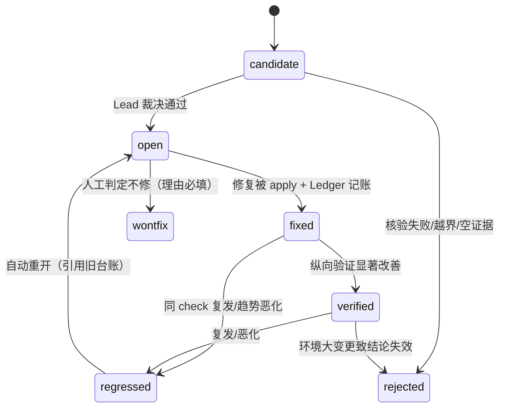

# AfterMatter 数据模型

状态: 定稿（设计阶段） | schema 基线版本: event=4 / episode=2 / bundle=3 / finding=2 | 修订: ADR-0007（host/provider 命名分离）、ADR-0008（frozen_hash）、ADR-0009（Comparison.axis_diff）、T1.2（定义 §0.1 ERef，event 2→3）、T1.3/ADR-0016（§1.1 采集侧类型与 source_id，event 3→4）| 更新: 2026-09-22

> 本文档是全项目的契约源头。**改代码可以先乱，改这里的字段必须先改文档并递增版本号。**
> 五维/检查项/证据状态/评分天花板继承并改造自 Better Harness（MIT）的 Agent Work Loop 模型。

---

## 0. 四层金字塔与铁律

```
L3 Finding          裁决后的发现（双大脑统一输出）
L2 EvidenceBundle   冻结证据快照（双大脑唯一输入）
L1 TaskEpisode      任务边界内的行为片段（分析基本单位）
L0 RawEvent         宿主会话归一化事件（解析器输出）
```

**铁律**：L3 的每个断言沿 `Finding.evidence → Episode 事实 → RawEvent → 原始字节` 可回溯；
`ERef` 解析失败或哈希与 `IntegrityManifest` 不符 → 断言作废（进 `rejected` 附录，不静默丢弃）。

所有模型为 pydantic v2，`model_config = ConfigDict(frozen=True)`（L0–L2 全不可变；
L3 状态迁移产生新 revision，不改旧行——纵向审计需要历史）。

## 0.1 ERef · 证据引用（字节区间制）

L0–L3 全部断言的落点单位，跨层引用一律用它，**不发明第二种指针形态**。

```python
class ERef(BaseModel):
    model_config = ConfigDict(frozen=True)
    source_id: str            # 证据源根的稳定别名（12 位小写 hex），跨边界数据只出现它
    source_path: str          # 相对该 source_id 所指源根的 posix 串（不含主机路径）
    byte_start: int           # >= 0，源文件字节偏移
    byte_len: int             # > 0，区间 [byte_start, byte_start + byte_len)
    digest: str               # 该区间原始字节的 sha256，64 位小写 hex
    line_no: int | None       # 人类可读提示，永不参与核验判定
```

`source_id` 派生规则（必须确定性）：`sha256(f"{host}\0{源根去 HOME 前缀}").hexdigest()[:12]`；
源根以 HOME 开头时替换为 `~`，剥不掉则用原文参与哈希——**输出永不包含路径**（ADR-0016）。
引入它是因为 Bundle 的三条 lane 必然同时引用仓库文件与宿主会话文件，两者源根不同目录。

核验语义（唯一实现处 `evidence.verify_ref`，流程见 [evidence.md](evidence.md)）：调用方提供
`source_id -> 源根` 映射，按 `[byte_start, byte_start + byte_len)` 重切原始字节、重算 sha256
与 `digest` 比对，返回 `ok | not_found | hash_mismatch | out_of_manifest`。

边界与不变量：

- 选字节区间而非行号：本机真实宿主会话实测单行最大 81,464 字节（p99 15,852），
  行级引用会把 80KB 一并拉进一条证据，且仓库/资产 lane 的证据本就不是行结构。
- `line_no` 允许与实际行号不一致且不影响结论——它是提示不是断言。
- 区间越过文件尾 → `not_found`：读不到属于“证据不在”，不等于“内容被改”。
- `source_id` 不在调用方提供的映射里、或 `source_path` 越出其源根 → `out_of_manifest`，
  **不抛异常**：引用失败必须能进报告 `rejected` 附录被审计，异常会被上层吞掉。
- 只读操作，永不修复、永不写回。

## 1. L0 · RawEvent

```python
class RawEvent(BaseModel):
    host: Literal["claude", "codex", "cursor", "qoder"]   # 编码宿主（ADR-0007）
    session_id: str                 # 宿主原始 id，出机前必须脱敏
    seq: int                        # 会话内单调序号
    ts: datetime                    # UTC；毫秒精度
    kind: EventKind                 # 见下表
    tool_name: str | None           # 工具调用类事件
    target_paths: tuple[str, ...]   # 归一化绝对路径→仓库相对路径
    command_text: str | None        # bash/命令类事件的原文（仅本机保存）
    cwd: str
    model: str | None               # 助手本轮使用的模型标识（混杂控制的关键）
    permission: Literal["routine", "prompted", "denied", "blocked"] | None
    result_ok: bool | None          # 工具结果成败
    evidence_ref: ERef              # 指回本事件在原始文件中的位置（必备）
    fingerprint: str                # 内容 sha256 前 16 位，幂等与去重
```

| kind | 含义 | 来源示例 |
|------|------|---------|
| `user_prompt` | 用户显式输入 | Claude JSONL `type=user` |
| `assistant_message` | 模型回复 | 同上 |
| `tool_call` / `tool_result` | 工具往返 | function_call / toolUseResult |
| `permission_decision` | 权限门事件 | 授权询问/拒绝 |
| `hook_event` | 生命周期钩子结果 | PreToolUse blocked 等 |
| `lifecycle` | 会话启动/恢复/压缩 | compact、resume |

**解析边界**：适配器只允许产生以上 kind；行级去向分三类且不得合并（见 §1.1 与 collectors.md）——
映射表命中的会话事件计入 `parsed`；本就不属 L0 事件模型的非会话事件计入 `ignored`（带类型名 reason）；
映射表外的**未知 type** 才计入 `unparsed_count` 并保留 ERef——**只有它是“格式漂移第一信号”**，
把预期忽略塞进它会淹没信号（对应设计文档 R1，见 [../PRD.md](../PRD.md) 的“§10 风险与对策”）。

## 1.1 L0 采集侧类型（适配器输出）

定义在 `evidence/models`（跨层模型唯一定义处），由 collectors 产出。三个模型均 `frozen=True`。

```python
class SessionRef(BaseModel):        # 一个宿主会话文件
    host: HostId                    # 与 RawEvent.host 同源（ADR-0007）
    source_id: str                  # 见 §0.1 派生规则
    path: str                       # 主机绝对路径，仅本机有效；出机数据一律用 source_id
    format_version: str | None      # 版本探测结果，未知为 None
    size: int                       # 字节数
    content_hash: str               # 整文件 sha256，用于 checkpoint 失效判定

class AdapterHealth(BaseModel):     # 宿主版本是否在支持矩阵内
    host: HostId
    support: Literal["ok", "unknown", "degraded"]
    detected_versions: tuple[str, ...]

class ParseStats(BaseModel):        # 行级去向，双计数器是这里的重点
    lines_total: int
    parsed: int                     # 映射表命中的会话事件
    ignored: int                    # 本就不属 L0 事件模型（非会话事件、thinking 块等）
    unparsed: int                   # 映射表外的未知 type——格式漂移信号
    not_ours: int                   # 归属判定认为不是本宿主写的，整文件不解析
    malformed_json: int             # 行不合法（非 JSON / 空对象）
    excluded_self_artifact: int     # 命中自污染清单被剔除
    outside_path_count: int         # 落在仓库根之外的路径（不写进 target_paths）
    reasons: Mapping[str, int]      # 按类型名/原因码的分布，只含枚举键，不含内容
```

约束：

- `SessionRef.path` 与 `ParseStats.reasons` 的键都是主机无关的枚举串，供 T1.9 的红线泄漏扫描复核。
- `ParseStats` 是采集侧运行统计，**不进 Bundle**（Bundle 的 `CoverageLedger` 外壳与聚合属 T1.8）；
- `not_ours` 与 `unparsed` 不得合并：前者是“整文件不属于本宿主”，后者是“属于本宿主但格式漂移”。

## 2. L1 · TaskEpisode

### 2.1 切分规则（先抄原版，双规则取并集）

1. **时间缺口**：相邻事件间隔 > `episode_gap_ms`（默认 30min，可配置）即断开；
2. **新任务 prompt**：`user_prompt` 判定为新目标（非澄清/纠错续接）即开新 Episode。
   纠错信号（"不对"、revert、同目标重试）留在**同一个** Episode 内——它们与目标同生共死。

一个 Episode = 一个用户目标 + 一个验收边界；可跨 session，不可合并无关工作。

### 2.2 结构

```python
class TaskEpisode(BaseModel):
    episode_id: str                 # fingerprint 派生，跨重跑稳定
    host: str; model_versions: tuple[str, ...]   # ← 混杂控制元数据（host=编码宿主，ADR-0007）
    workspace: str                  # 仓库相对标识（不含用户主目录）
    git: GitContext                 # branch, base_commit, head_commit
    window: (datetime, datetime)

    intent: IntentFacet             # prompt 语义化摘要（脱敏后可出机）
    acceptance_cues: tuple[ERef, ...]   # 用户声明的"完成标准"证据
    edits: tuple[EditFact, ...]         # 触达文件、增删行数、edit 次数
    validations: tuple[ValidationFact, ...]
    friction: tuple[FrictionFact, ...]  # 权限拒绝/失败重试/用户纠错/hook 拦截
    outcome: OutcomeFact | None         # 提交? 末次验证结果? 交付边界事件?
    comparability: ComparabilityFeatures
```

| 子模型 | 字段要点 |
|--------|---------|
| `ValidationFact` | `category`: test/lint/build/typecheck/security；`identity`: 命令归一化串（NFKC+空白折叠）；`claimed_ok`: Agent 转述结果；`replay_ok`: **沙箱复跑结果（可空，B 引擎回填）**；`refs`: 执行证据 ERef |
| `FrictionFact` | `type`: retry-same-command / denied / user-correction / hook-block；`count`、`refs` |
| `ComparabilityFeatures` | `task_type`（枚举+置信度）、`scale`（文件数/行数分桶）、`tool_shape`（调用序列指纹向量）、`embedding_ref`（本地向量库主键，原文不出机） |

## 3. L2 · EvidenceBundle

```python
class EvidenceBundle(BaseModel):
    bundle_id: str; bundle_version: int = 3   # 基线随头部 schema 版本同步（ADR-0009 起 bundle=3）
    scope: Scope          # target, hosts, window(since/until), depth(quick/normal), locale
    lanes: Lanes          # 三条，结构上互不可见（不同 Python 子模型，禁止交叉引用）
      session:  SessionLane   # episodes: tuple[TaskEpisode, ...]
      project:  ProjectLane   # repository_evidence: AGENTS.md 质量信号/测试布局/CI/
                              # git 共变历史/当前 diff 概要
      assets:   AssetsLane    # rules/skills/hooks/mcp/memory/commands 清单与 lint 信封
    integrity: IntegrityManifest   # 每个证据源: {path, sha256, size}——冻结时刻的全集哈希
    status: tuple[LaneStatus, ...] # 每 lane: available | partial | unavailable + reason
    coverage: CoverageLedger       # 读了哪些会话、跳了哪些、为什么
```

约束（协议级，不靠 prompt）：

- **专家 Agent 的输入类型就是单条 Lane 的模型类**，拿不到其他 lane——隔离由类型系统保证；
- `partial/unavailable` 必须带机器可读 `reason_code`；normal 深度下 Lead 见到非 available
  即中止（quick 透传降置信）；
- Bundle 一旦写入 run-dir 即内容寻址（bundle_id 含 integrity 哈希），**永不改写**；
- 计数字段（资产数量等）**只用于路由检查方向，禁止参与评分**——继承原版
  "counts never create findings or scores"。

## 4. L3 · Finding 与状态机

### 4.1 结构

```python
class Finding(BaseModel):
    finding_id: str; revision: int = 1
    title: str                      # 只写被证据支持的"当下后果"，禁止未来恐吓式标题
    severity: Literal["critical", "high", "medium", "low"]   # 仅 Lead 可赋值
    dimension: DimensionId          # 五维之一（§5）
    check: CheckId                  # 15 检查之一
    consequence: str                # 现在会发生什么坏处（WHY IT MATTERS）
    expected_outcome: str           # 修复后应观察到什么（EXPECTED OUTPUT，与影响成对）
    evidence: tuple[ERef, ...]      # ≥1，全部过引用闸核验
    confidence: Literal["high", "medium", "low"]
    repair: RepairSpec | None       # 白名单目标/边界/验收检查
    origin: Literal["engine", "host", "manual"]   # 哪个大脑产出
    frozen_hash: str | None         # Lead freeze 阶段写入本 revision canonical JSON 的 sha256（ADR-0008）；冻结前为 None
    lifecycle: LifecycleState; lifecycle_history: tuple[...]
```

### 4.2 生命周期状态机（流转白名单，白名单外迁移 = 代码层拒绝 + 告警）



流转白名单（权威定义，白名单外迁移 = 代码层拒绝 + 告警）：

| 迁移 | 触发者 | 条件 |
|------|--------|------|
| candidate→open | Lead Judge | 引用闸+基线闸通过，完成定级 |
| candidate/any→rejected | Verifier（确定性） | ERef 核验失败、lane 越界、空证据 |
| open→fixed | Repair 流程 | diff 已应用且 Ledger 记账成功 |
| open→wontfix | 人工 | 显式命令 + 理由必填（真实团队必须有出口） |
| fixed→verified | Longitudinal | E3–E5：可比 + 无混杂 + 统计显著 |
| fixed→regressed / verified→regressed | Longitudinal | 同 check 复发或趋势恶化 |
| regressed→open | 自动 | 重开并引用旧台账与旧证据 |

**severity 与 lifecycle 正交**：wontfix 不降 severity；regressed 不升 severity（重裁）。

### 4.3 InterventionLedger（干预台账，纵向验证的事实源）

```python
class InterventionRecord(BaseModel):
    intervention_id: str; finding_id: str; episode_of_origin: str
    applied_at: datetime
    diff_digest: DiffDigest        # 文件清单 + 行数 + 内容哈希（不存原文）
    environment: EnvSnapshot       # model_versions / host / llm_provider / 配置哈希 / 关键依赖哈希（ADR-0007 消歧）
    acceptance_checks: tuple[CheckResult, ...]     # 修复自验结果
    comparison_verdicts: tuple[Comparison, ...]    # 后续每次纵向比较的结论追加于此
```

`Comparison` 必须记录：对哪些 Episode 比较、可比性置信度、**拒绝比较的排除清单及原因**
（混杂）、统计方法、效应量、CI、样本缺口（"还需 N 个可比任务"）、
`axis_diff: Literal["single", "multi", "none"]`（单轴归因，ADR-0009）：
single = 恰一处理轴不同，才可产出归因结论（verified 资格）；
multi = 多轴不同，仅 descriptive，无 verified 资格；none = 零轴，记为噪声地板测量样本。

## 5. 评估模型：五维 × 15 检查（继承原版，稳定 ID）

| 维度 ID | 读者问题 | 检查 ID |
|---------|---------|---------|
| `task-understanding` | 是否理解目标与"完成"的定义 | `goal-understanding` / `relevant-context` / `scope-boundary` |
| `controlled-execution` | 是否走在受支持可复现的路径 | `instruction-led-start` / `supported-operation` / `permission-boundary` |
| `change-validation` | 有无证据说明改动真的有效 | `relevant-check` / `failure-repair` / `validate-again` |
| `reliable-delivery` | AI 速度是否绕过了验收与恢复路径 | `acceptance-evidence` / `high-risk-approval` / `rollback-recovery` |
| `learning-capture` | 下个任务能否受益 | `lifecycle-repeat-detection` / `loop-engineering` / `later-validation` |

我们相对原版的**检查级增强**：

- `relevant-check` 新增执行级证据：`claimed_ok` vs `replay_ok` 双记录（B 引擎）；
- `later-validation` 从"存在趋势记录"强化为统计检验（A 引擎，E3–E5）；
- `loop-engineering` 的"改进有效"判定必须挂 Ledger，不接受口头宣称。

## 6. 证据状态与评分天花板

```
Present ≤74 │ Wired ≤84 │ Exercised ≤94 │ Outcome-supported ≤100
Missing / Unobserved / Not-applicable ≤59
```

- 维度分数 = 三检查加权后**再被该维度最高证据状态的天花板截断**（校验器强制）；
- `Outcome-supported` 只能由纵向比较结论（§4.3 Comparison 显著改善）授予——
  **这是"闭环是否真的转起来"在 schema 层的唯一入口**；
- finding 数量不参与分数（防多报激励）；分数范围不映射为 finding 等级。

## 7. Schema 版本化策略

- 四个模型族各自独立版本号；Bundle 冻结时记录全部版本号（双大脑与报告校验器据此选解析路径）；
- 只增不改不删：字段废弃走 `deprecated` 标注 + 两个大版本移除窗口；
- 迁移器集中在 `aftermatter/migrations/`，SQLite schema 与模型版本双轨同步（alembic/自建）；
- 版本不匹配的 Bundle：**拒绝分析并报错**，不做猜测性向前兼容（诚实原则的一致性延伸）。
